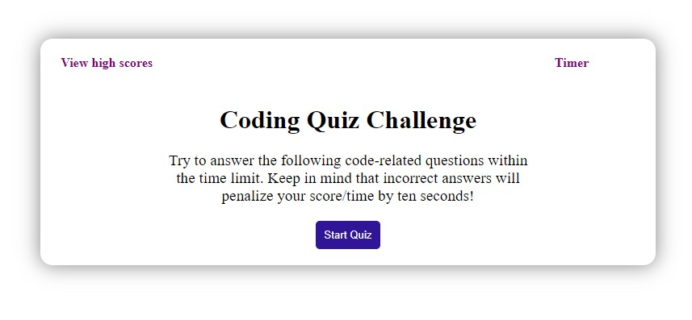
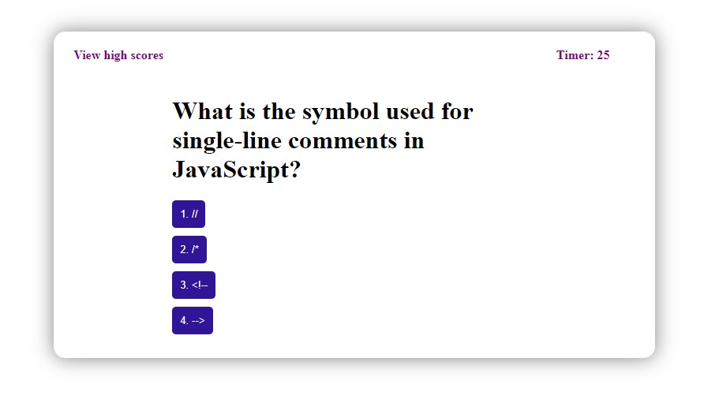
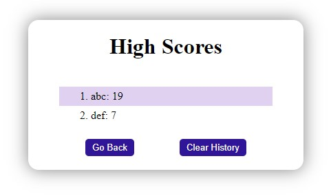

# Code Quiz

This application is a timed code quiz that presents the user with a series of multiple-choice questions. The user's score is determined by the number of questions answered correctly and the amount of time remaining on the timer.

# Usage

To use this application, simply click on the "Start" button to begin the quiz. You will have a limited amount of time to answer all questions. If you answer a question incorrectly, 10 seconds will be subtracted from the clock. If you answer all questions correctly you will then be prompted to enter your initials to save your score. If the timer reaches 0, the game will be over and you will be taken to the starting page. 

# Functionality

This quiz application uses JavaScript to dynamically generate HTML and CSS to style the page. The application is fully responsive, making it easy to use on a variety of devices. 

# Built With

This application was built using the following technologies:

- HTML
- CSS
- JavaScript
